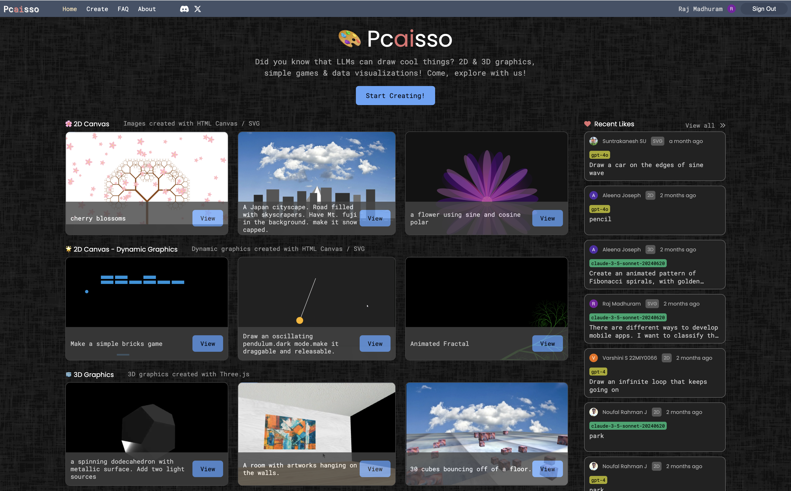
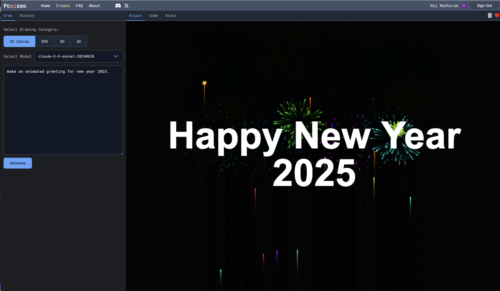

Welcome to Pcaisso!!!

Pcaisso is a tool for generating graphics using AI. I was curious to see how LLMs can generate code for drawing things, and hence this project was born!






## Getting Started

First, install the dependencies:  

```bash
npm install
# or
yarn install
# or
pnpm install
# or
bun install
```

Then, run the development server:

```bash
npm run dev
# or
yarn dev
# or
pnpm dev
# or
bun dev
```

Open [http://localhost:3000](http://localhost:3000) with your browser to see the result.


## Learn More

To learn more about Next.js, take a look at the following resources:

- [Next.js Documentation](https://nextjs.org/docs) - learn about Next.js features and API.
- [Learn Next.js](https://nextjs.org/learn) - an interactive Next.js tutorial.

## Contributing to Pcaisso

Pcaisso is an open source project, and we welcome contributions from the community. If you have an idea for a new feature or have found a bug, please feel free to open an issue or submit a pull request. 

Contact me at [@rmadhuram](https://www.linkedin.com/in/rmadhuram/) for more information.


